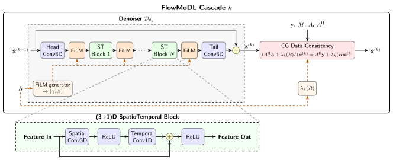
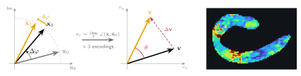
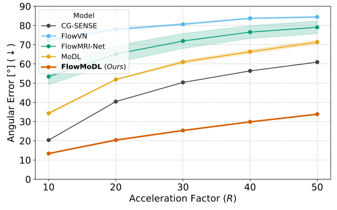
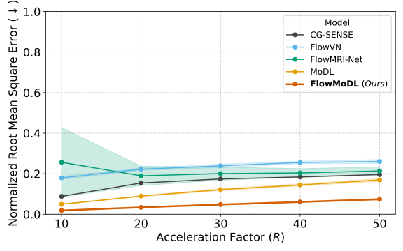
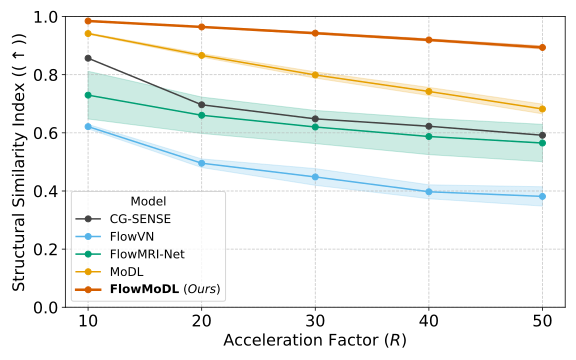
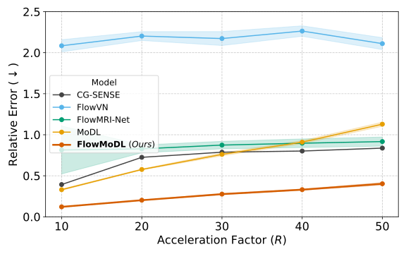
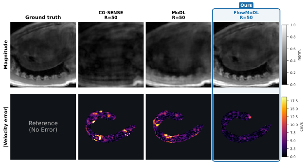
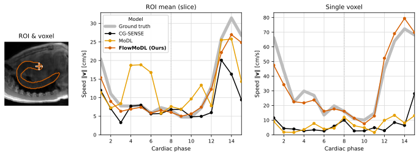

# FlowMoDL

**Model-Based Deep Learning with Conjugate-Gradient Data Consistency for Highly Accelerated 4D Flow MRI Reconstruction**

Tristan Gottwald, Michelle Bruch, Mubashir-Ul Hassan, Fatma Alickovic, Milan Kloiber, Daniel Tenbrinck, Torsten Panholzer, Melanie Schaller, Jana Hutter

FlowMoDL is an unrolled network for highly accelerated 4D flow MRI reconstruction. It alternates a learned (3+1)D spatiotemporal denoiser with conjugate-gradient (CG) data-consistency updates based on the SENSE forward model. It is optimised directly for both the anatomical magnitude and the phase-derived velocity field. A single trained model covers acceleration factors from R = 10 to R = 50.

<p align="center">
  
</p>

*One FlowMoDL cascade k. The denoiser maps the previous estimate to an intermediate target z⁽ᵏ⁾ through a (3+1)D spatiotemporal CNN with a global residual connection. The acceleration factor R conditions both the denoiser (FiLM) and the data-consistency weight λₖ(R). The cascade ends with a CG solve of the data-consistency equations.*

## Method

Given undersampled multi-coil k-space **y**, coil sensitivities S and a kt undersampling mask M, FlowMoDL reconstructs the complex image series **x** of the Nv = 4 velocity encodings. The velocity follows from the phase difference between each flow-encoded image and the reference encoding, vᵢ = v_enc / π · ∠(**x**ᵢ **x̄**₀).

- **Unrolled MoDL with CG data consistency.** Starting from x⁽⁰⁾ = Aᴴy, each of the K cascades computes z⁽ᵏ⁾ = D_θₖ(x⁽ᵏ⁻¹⁾, R) and then solves (AᴴA + λₖ(R) I) x⁽ᵏ⁾ = Aᴴy + λₖ(R) z⁽ᵏ⁾ with J CG iterations. The fully sampled readout axis is transformed to image space once, before the first cascade. Every CG iteration then only needs 2D FFTs and still solves exactly the same problem.
- **(3+1)D denoiser.** The real and imaginary parts of all four encodings are stacked as channels, so inter-encoding phase relationships are processed jointly. The residual blocks factorise into a spatial 3D convolution per cardiac phase and a temporal 1D convolution per voxel. The last convolution is zero-initialised, so every cascade starts as the identity. Each cascade has its own denoiser.
- **Acceleration conditioning.** The log acceleration factor drives a FiLM generator (per-channel scale and shift after the stem and after every residual block). A separate MLP predicts a per-sample offset of the data-consistency weight λₖ(R). Both have zero-initialised output layers.
- **Flow-aware composite loss.** The loss combines deep supervision of all cascades (weights wₖ = exp(−τ(K − k))) with an image L1 term and three velocity terms: velocity L1, a relative speed error and an angular cosine distance. A curriculum first optimises the magnitude and then ramps in the velocity terms and, after them, the angular term.

<p align="center">
  
</p>

*Small phase errors δφ in a single encoding translate into velocity magnitude and direction errors (Δ**v**, θ), which is why the loss penalises them explicitly.*

## Results

Mean over the unseen test set and all acceleration factors (R ∈ {10, 20, 30, 40, 50}). Learned models are averaged over five seeds and trained with the same budget of gradient steps (50 epochs).

| Model | nRMSE ↓ | SSIM ↑ | RelErr ↓ | AngErr [°] ↓ |
|---|---|---|---|---|
| CG-SENSE | 0.1592 | 0.6831 | 0.7087 | 45.69 |
| FlowVN | 0.2311 ± 0.0061 | 0.4687 ± 0.0200 | 2.1668 ± 0.0648 | 79.85 ± 0.42 |
| FlowMRI-Net | 0.2126 ± 0.0540 | 0.6325 ± 0.0602 | 0.8660 ± 0.0741 | 69.22 ± 3.78 |
| MoDL | 0.1147 ± 0.0035 | 0.8062 ± 0.0095 | 0.7412 ± 0.0126 | 56.99 ± 0.62 |
| **FlowMoDL** | **0.0469 ± 0.0017** | **0.9409 ± 0.0026** | **0.2664 ± 0.0065** | **24.56 ± 0.25** |

<table>
  <tr>
    <td></td>
    <td></td>
  </tr>
  <tr>
    <td></td>
    <td></td>
  </tr>
</table>

*Metrics over the acceleration factor. Lines show the mean, shaded areas the standard deviation over five seeds.*

<p align="center">
  
</p>

*Magnitude and velocity error at R = 50 for CG-SENSE, MoDL and FlowMoDL.*

<p align="center">
  
</p>

*Speed over the cardiac cycle at R = 50, averaged over the aortic ROI of one slice (middle) and for a single voxel (right).*

## Installation

The environment is managed with [uv](https://docs.astral.sh/uv/). From the repository root:

```bash
uv sync
```

This installs Python 3.11 and PyTorch built for CUDA 12.8. Training uses bf16 mixed precision and gradient checkpointing, and fits on a single 48 GB GPU.

## Data preparation

The experiments use the training data of the [CMRx4DFlow 2026 challenge](https://cmrxrecon.github.io/2026/data.html) (task R1/R2, aorta, 138 cases from several centres and vendors).

### 1. Download

See the challenge website for data access. The data can be downloaded from Google Drive with `gdown` (included in the dev dependencies):

```bash
uv run gdown https://drive.google.com/drive/folders/1dD0rjAX1WhEB9cqFUbFdiUBwX65HQZzt -O <download_dir> --folder --continue
```

If the download stops, rerun the command (`--continue` resumes it). If Google throttles the download but the files still open in your browser, export your browser cookies (e.g. with the *Get cookies.txt LOCALLY* extension) to `~/.cache/gdown/cookies.txt` and run the command again.

The raw training data has one directory per case:

```
ChallengeData/TaskR1R2/TrainSet/Aorta/<Center>/<Vendor>/<Patient>/
├── kdata_full.mat   # fully sampled k-space (Nv, Nt, Nc, SPE, PE, FE), complex
├── coilmap.mat      # coil sensitivity maps (Nc, SPE, PE, FE), complex
├── segmask.mat      # aorta segmentation (SPE, PE, FE)
└── params.csv       # VENC, matrix size, resolution, ...
```

### 2. Preprocessing

Reading the MATLAB files during training is slow. They are therefore converted once into one chunked, LZ4-compressed Zarr store per case:

```bash
uv run python -m data.offline_preprocessing --data_root <path>/ChallengeData/TaskR1R2/TrainSet
```

For every case the script

1. loads the fully sampled k-space, the coil maps, the segmentation and `params.csv`,
2. swaps the coil and cardiac-phase axes to `(Nv, Nc, Nt, SPE, PE, FE)`,
3. applies a centred inverse FFT along the fully sampled readout axis (FE). The undersampling mask is constant along this axis, so a training crop can be cut along the readout direction directly (hybrid kz–ky–x layout),
4. normalises the coil maps to unit sum-of-squares,
5. writes `data_x` (k-space), `smaps` and `segmask` into `data_compressed.zarr`, with all entries of `params.csv` stored as attributes.

The output mirrors the input tree next to it, with the `TaskR1R2` path segment replaced by `TaskR1R2_compressed` (change this with `--output_root`):

```
ChallengeData/TaskR1R2_compressed/TrainSet/Aorta/<Center>/<Vendor>/<Patient>/data_compressed.zarr
```

Optional flags: `--format h5` writes HDF5 instead of Zarr (then set `data_format=h5` for training). `--compress_coils --target_nc N` additionally SVD-compresses the coils to N virtual coils (writes `data_compressed_ncN.zarr`). The configurations used in the paper use Zarr without coil compression.

### 3. Train / validation / test split

The split used in the paper is included in [`data/dataset_splits.yaml`](data/dataset_splits.yaml): a random split with seed 42 into 96 training, 21 validation and 21 test cases. [`data/dataset_meta.yaml`](data/dataset_meta.yaml) lists the centres and scanners in each subset. You only need to create a split if you want a different one:

```bash
uv run python -m data.create_split --data_root <path>/ChallengeData/TaskR1R2/TrainSet
```

### 4. Undersampling masks for validation and test

During training, a new kt-Gaussian mask is drawn on the fly for every sample, at a random acceleration factor R ∈ {10, 20, 30, 40, 50}. Validation and test use fixed, pre-generated masks created with the same kt-Gaussian sampling scheme:

```bash
uv run python -m data.create_test_val_umasks --data_root <path>/ChallengeData/TaskR1R2/TrainSet
```

This writes `usmask_ktGaussian{10,20,30,40,50}.zarr` into every validation and test case directory of `TaskR1R2_compressed`. Add `--formats zarr h5` if you train on HDF5 files.

### 5. Point the code to the data

All training configurations read the preprocessed TrainSet directory from the environment variable `FLOWMODL_DATA_ROOT`:

```bash
export FLOWMODL_DATA_ROOT=<path>/ChallengeData/TaskR1R2_compressed/TrainSet
```

Alternatively, pass `data.root=<path>` on the command line.

### What happens on the fly

The data loader ([`data/dataset.py`](data/dataset.py)) turns each preprocessed case into a training sample as follows:

- **Cropping (training only):** random crops of 6 consecutive cardiac frames (FlowMoDL, MoDL; wrapping around the cardiac cycle) and 64 readout samples. The phase-encode axes are never cropped. Validation and test use full volumes.
- **Undersampling:** the fully sampled k-space is multiplied by the kt-Gaussian mask.
- **Ground truth:** the coil-combined inverse FFT of the fully sampled k-space, `Σ_c conj(S_c) · F⁻¹(k_c)`.
- **Normalisation:** undersampled k-space and ground truth are divided by the RMS magnitude of the acquired k-space samples.

By default (`reconstruct_target_on_gpu: true`) the last three steps run batched on the GPU inside the training loop instead of in the data-loader workers.

## Training

```bash
uv run train.py                              # FlowMoDL
uv run train.py --config-name config_modl    # MoDL baseline
uv run train.py --config-name config_flowvn  # FlowVN baseline
```

Configuration is handled by [Hydra](https://hydra.cc). Every value can be overridden on the command line, e.g. `uv run train.py seed=43 training.epochs=30`. Metrics and validation images are logged to [Weights & Biases](https://wandb.ai). Set `WANDB_MODE=offline` or `WANDB_MODE=disabled` to train without an account.

Every `validation.val_interval` epochs the model is validated at R = 30. Every second validation (and the first one) it is also evaluated at R ∈ {10, 30, 50}. The checkpoint is kept if that epoch has the best rank sum over nRMSE, SSIM, RelErr and AngErr among all evaluated epochs (the ranking rule of the challenge). Checkpoints are written to `checkpoints/<wandb.name>_seed<seed>_best.pth`.

The paper reports means over five seeds. Train them with `seed=42` … `seed=46`. Under a SLURM job array the seed is offset automatically by the array task index. Setting `data.train_on_all_data=true` trains on all 138 cases without checkpoint selection, saving the latest weights (e.g. for a final model with a fixed epoch budget).

### Hyperparameters

| | |
|---|---|
| Cascades K | 8, independent denoiser and λₖ per cascade |
| CG iterations J | 30 per cascade |
| λ initialisation | 0.05, conditioned on R |
| Denoiser | 64 channels, 1 residual (3+1)D block, 3×3×3 spatial kernel, temporal kernel 5, replicate padding |
| Loss weights | ω_vel = ω_rel = ω_ang = 0.1, background weight of the image term 0.1 |
| Curriculum | velocity and relative-error terms ramp in linearly over 12 epochs from epoch 8; the angular term then ramps in over 12 epochs |
| Deep supervision | τ = 10⁻⁴ × optimizer step |
| Optimiser | AdamW, lr 10⁻³, cosine annealing to 10⁻⁶ over 50 epochs, gradient clipping at 1.0, batch size 1 |
| Crops | 6 cardiac frames × 64 readout samples × full phase-encode extent |
| Precision | bf16 autocast for the denoiser convolutions, fp32 for SENSE operators and CG; gradient checkpointing |

## Evaluation

[`evaluate.py`](evaluate.py) evaluates the zero-filled and CG-SENSE baselines and any trained checkpoints on the test (or validation) cases for every acceleration factor:

```bash
uv run evaluate.py --root_dir $FLOWMODL_DATA_ROOT \
    --flowmodl_ckpt checkpoints/flowmodl_seed42_best.pth \
    --modl_ckpt checkpoints/modl_seed42_best.pth \
    --flowvn_ckpt checkpoints/flowvn_seed42_best.pth \
    --output_csv results.csv
```

It reports nRMSE and SSIM of the magnitude, RelErr and AngErr of the velocity inside the aorta, a complex-difference error and the reconstruction time, per R and averaged over all R. As in the official challenge evaluation, a smooth background phase offset is fitted to the ground truth with MSAC ([`utils/bgc.py`](utils/bgc.py)) and removed from ground truth and reconstruction before the velocity metrics are computed. Checkpoints of the other seeds of the same run (`..._seed43_best.pth`, ...) are found automatically, and their mean and standard deviation are written to `results_seed_summary.csv`.

## Inference on new data

[`predict.py`](predict.py) reconstructs data without ground truth in the challenge layout (e.g. the official ValidationSet): `coilmap.mat`, `segmask.mat`, `params.csv` and pairs of `kdata_ktGaussian{R}.mat` / `usmask_ktGaussian{R}.mat` per case. Cases are discovered recursively, and the reconstructions are written as sparse `.npz` files in the challenge submission format, mirroring the input directory tree:

```bash
uv run predict.py --ckpt_path checkpoints/flowmodl_seed42_best.pth \
    --model_config configs/model/flowmodl.yaml \
    --input_dir <path>/ChallengeData/TaskR1R2/ValidationSet \
    --output_dir predictions
```

## Citation

If you use this code, please cite:

```bibtex
TODO
```

## Acknowledgments

This work was supported by DFG Heisenberg (502024488), ERC StG EARTHWORM (101165242), ERC Proof-of-concept grant SYNCWORM (101293293) and CAIMed – Lower Saxony Center for Artificial Intelligence and Causal Methods in Medicine (ZN4257).
